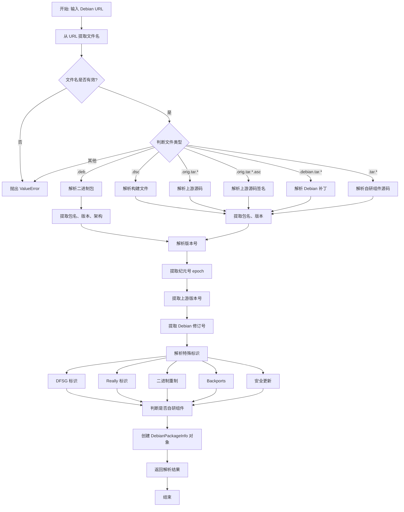
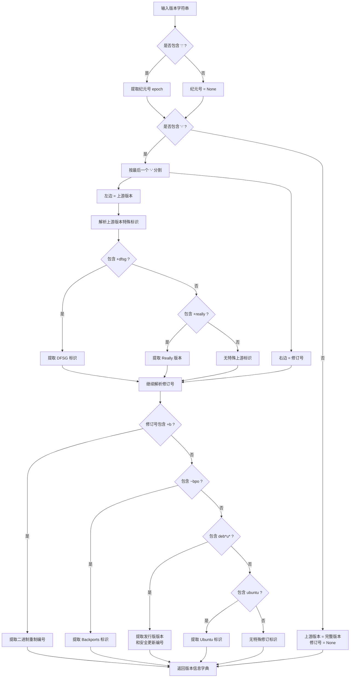
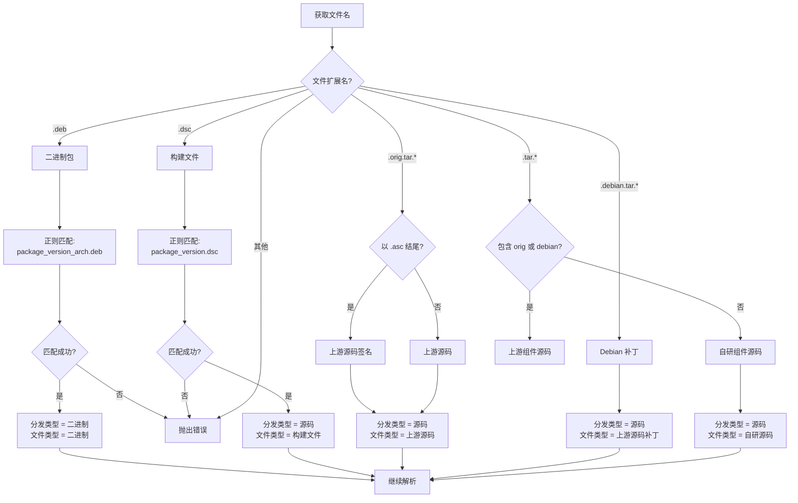
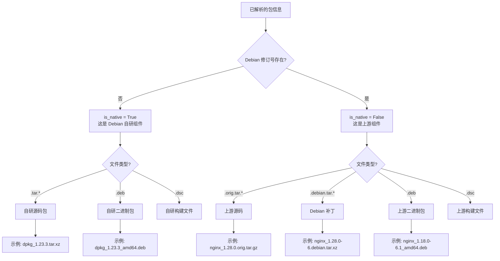
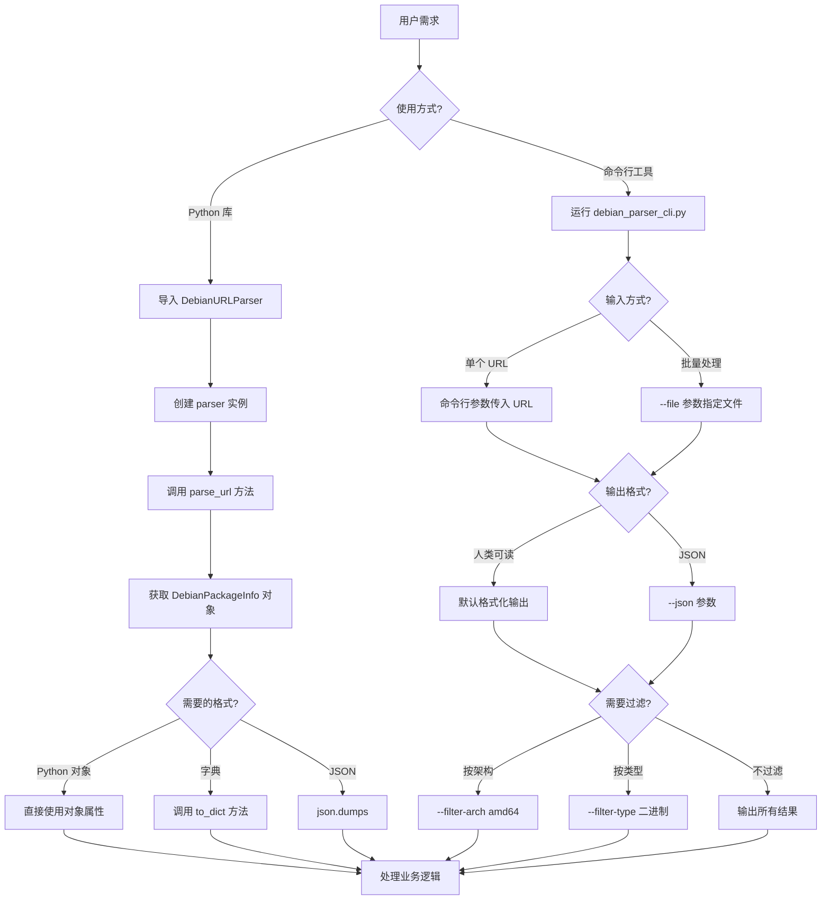
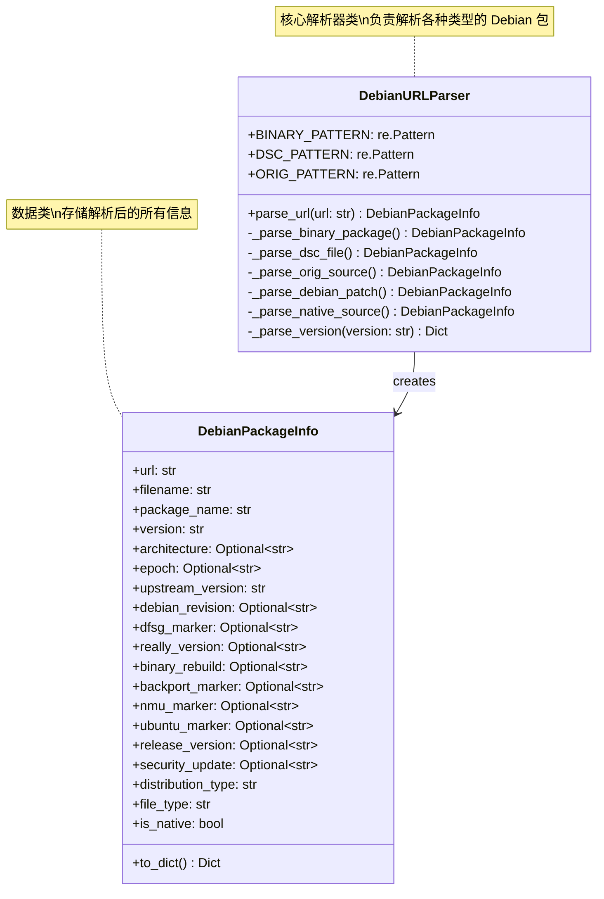
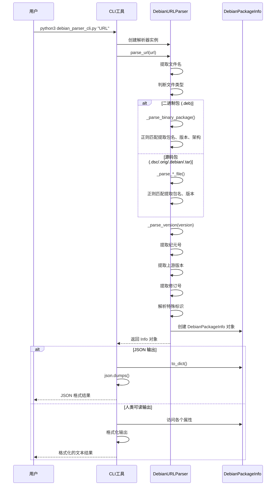
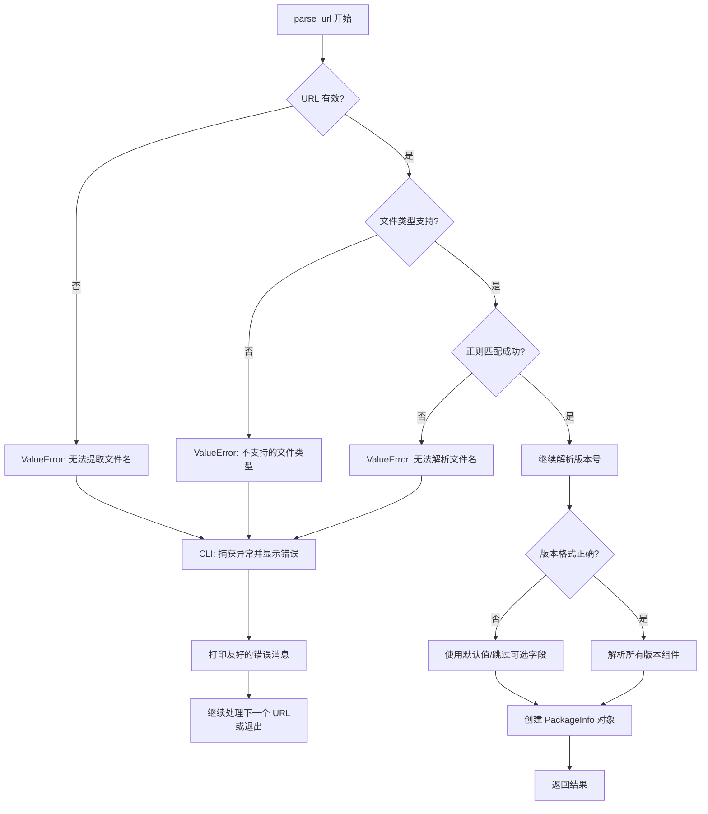

# Debian URL 解析器流程图

## 1. 主流程图

## 2. 版本号解析详细流程

## 3. 文件类型判断流程

## 4. 自研组件识别流程

## 5. 使用场景流程

## 6. 数据结构关系图

## 7. 完整示例流程

## 8. 错误处理流程

## 流程图说明

### 图 1: 主流程图
展示从输入 URL 到输出解析结果的完整流程，包括文件类型判断、版本解析、特殊标识提取等关键步骤。

### 图 2: 版本号解析详细流程
专门展示版本号解析的详细过程，包括纪元号、上游版本、修订号以及各种特殊标识的提取逻辑。

### 图 3: 文件类型判断流程
展示如何根据文件扩展名和正则表达式判断文件类型（二进制/源码）和具体分类。

### 图 4: 自研组件识别流程
展示如何区分 Debian 自研组件和上游组件的逻辑。

### 图 5: 使用场景流程
展示用户如何使用解析器（Python 库或 CLI 工具）以及各种输出格式和过滤选项。

### 图 6: 数据结构关系图
展示核心类之间的关系和各类的属性方法。

### 图 7: 完整示例流程
使用时序图展示一次完整的解析过程中各组件之间的交互。

### 图 8: 错误处理流程
展示各种错误情况的处理流程。

## 如何查看流程图

这些流程图使用 Mermaid 语法编写。您可以通过以下方式查看：

1. **GitHub**: 直接在 GitHub 上查看此 Markdown 文件，会自动渲染
2. **VS Code**: 安装 "Markdown Preview Mermaid Support" 插件
3. **在线工具**: 复制代码到 https://mermaid.live/ 查看
4. **Typora**: 支持 Mermaid 的 Markdown 编辑器

## 快速理解建议

1. **新手**: 先看"图 1: 主流程图"和"图 7: 完整示例流程"
2. **开发者**: 重点看"图 2: 版本号解析"和"图 6: 数据结构关系图"
3. **用户**: 看"图 5: 使用场景流程"了解如何使用
4. **调试**: 看"图 8: 错误处理流程"了解异常处理

